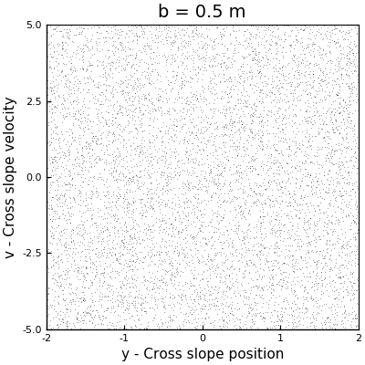

# Moguls of Chaos

What are the moguls and why are they related to chaos? Mogul skiing is a ski discipline that consists of descending a slope full of small regular bumps, where the skills and technique of skiers are tested to its full. Ed Lorenz, an outdoorsman and science legend, discovered that objects descending the moguls exhibit chaotic behavior. He built a small numerical model to explore the dynamics of an idealized board descending such type of slopes and exemplified some of the tools used for characterizing chaos.

This project aims to perform the small numerical experiment that Ed did and explained in his book *The Essence of Chaos*.

I started this small project two years ago after reading the above-mentioned book, but I couldn't finish it, and given that I am required to do a small project for my scientific computing class, I will use this opportunity to finish once and for all this mini-project. Also, this problem is an excuse to refresh my very rusty Julia skills and to keep my Python skills sharp.

## Structure

You will find two Jupyter notebooks in this repo, one written in Julia and the other in Python. Both notebooks are similar and solve the same exercises. If you want to run one of these notebooks, I will suggest running the Julia one, because it is way faster, especially for computing the bifurcation diagram.

Also, I put the explanation and the results (code-free) in a blog post that you can find [here](https://cpierard.github.io/projects/moguls-of-chaos/).

## Objectives

- [x] Build the code in Julia.
- [x] Build the code in Python.

## References

- Lorenz, Edward N. *The Essence of Chaos*. Univ. of Washington Press, 1993.
